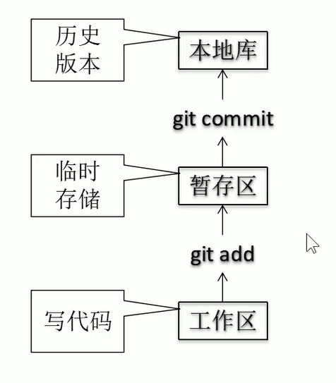

# Git 基本操作
## linux命令
cd：前面指定目录  
cd .. ：返回上一层  
cd ~ ：返回home目录  
ll，ls -la（带隐藏资源）：列出该层所有文件  
mkdir：新建文件夹  
pwd：显示目录  
cat：打印文件  
rm：删除

## Git 命令
1. 本地库初始化：git init
2. 签名：git config （--global） user.name（email） xxx  
   1. 项目级别（文件夹.git的config文件里）  
   2. 用户级别（home目录的.gitconfig文件里）
3. 基本操作  
   1. git status：查看状态
   2. git add：将工作区的"新建/修改"添加到暂存区
   3. git commit -m"commit message"[filename]：提交
     
4. 版本穿梭:主要是reflog和reset
   1. 查看提交的历史记录(HEAD指针指向当前版本)
      * git log（--pretty=oneline显示哈希值）(--oneline显示部分哈希值)
      * git reflog（推荐）：显示部分哈希值 + HEAD@{移动到当前版本需要多少步}，当前版本是HEAD@{0}
      * 注：多屏操作，空格向下翻页，b向上翻页，q退出
   2. 前进后退：reset
      * 基于索引值（哈希值）（推荐）：git reset --hard 部分哈希值（当前版本就是个HEAD）
      * 异或 ^和~（只能后退，一个^移动一步） :git reset --hard HEAD^^^ == HEAD~3
   3. reset的参数对比
      * --soft：仅在本地库移动HEAD指针
      * --mixed：在本地库移动HEAD指针，重置暂存区
      * --hard（更多）：在本地库移动HEAD指针，重置暂存区和工作区
   4. 找回删除文件的前提：删除前的版本上传到了本地库
      * 删除操作提交到本地库：指针指向历史版本
      * 删除操作未提交到本地库：指针指向HEAD
5. 比较文件差异
   * **git以行为单位进行文件管理**
   1. git diff[文件名]：将工作区中的文件与暂存区比较
   2. git diff[本地库的历史版本][文件名]：将工作区的文件和本地库的历史记录比较
   3. git diff 不加文件名：比较所有的文件
6. 文件的分支（branch）
   1. 查看分支 git branch -v
   2. 新建分支 git branch hot_fix
   3. 切换分支 git checkout hot_fix
   4. 合并分支
      1. 切换到接受修改的分支上（例：git checkout master）
      2. git merge hot_fix（你的修改）
   5. 冲突解决：两个分支修改了一个地方（同一行）
      * 此时状态为：接受修改的分支|merging
      * 手动修改文件vim：删除特殊符号，自己决定保留哪一个修改
      * add + commit（不能带文件名）：git commit -m"日志信息"
   6. 分支管理原理：
      1. 集中式（增量式，svn）：每个新版本保存修改的部分。
      2. 分布式（快照流，git）：重复的文件，用指针指向前面的文件。修改的文件（行）就新建保存在版本里。
         * 每个对象都有个哈希值，最后提交对象也有。哈希值就是地址
         * 新建分支：就是新建一个指针testing。
         * 切换分支：HEAD指针指向testing。切回master就把HEAD指针指回master。
7. 上传远程库
   1. 查看远程库 git remote -v
   2. 添加远程库（取名叫origin）git remote add origin 网址
   3. 推送（push）git push origin master 
   4. 克隆（clone）：git clone [远程地址]
      * 下载远程库到本地
      * 创建origin远程地址别名（remote）
      * 初始化本地库（init）
   5. 拉取（pull） = fetch + merge  ：git pull origin master
      * git fetch origin master（[远程库地址][远程分支名] ） 
      * git merge origin/master（[远程库地址/远程分支名] ） 
      * 注：git checkout origin/master或者master可以选择切换fetch的和本地的（远程：origin/master，本地：master）
   6. 冲突：两人同时推送，后推送的要先拉取再推送。
   7. 跨团队协作：
      1. 外援点fork：把远程库复制成自己的远程库。clone，修改，push。
      2. 外援点Pull Request。
      3. 本人点Pull Request，审核代码，点Merge pull request合并。
      4. 本人pull拉取到本地
