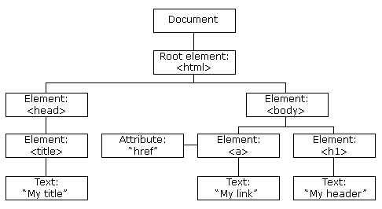

# 初级教程
## 一、基础知识
1. 基本用法
   1. 在网页上面写脚本：`<script></script>`
   2. 位置：`<head>`，`<body>`或外部.js文件`<script src="myScript.js"></script>`
2. 输出
   1. 弹出警告框：`window.alert()`
   2. 修改HTML元素：`document.getElementById("demo").innerHTML = "修改后的段落";`
   3. 写到HTML文档：`document.write();`
      * 如果在文档已完成加载后（如按钮）执行 document.write，整个 HTML 页面将被覆盖。
   4. 写到控制台：console.log()
3. 语法
   1. 字面量（固定常量）：数字，字符串，对象，函数
      1. 字符串用''或""都行，字符串中用\添加特殊字符（转义字符）
      2. 数组用[]
      3. 对象{firstName:"John", lastName:"Doe", age:50}
      4. 函数function myFunction(a,b){return a*b;}
   2. 变量，var定义。=赋值。驼峰法命名。一个var能定义多个。
      * 把值赋给尚未声明的变量，该变量将被自动作为 window 的一个属性。`var2 = 2;`访问`window.var2;`删除`delete var2;`  
   3. 注释//，/**/
4. 数据类型：JavaScript拥有动态类型，相同的变量可用作不同的类型（数字能改成字符串）。
5. 对象：有属性和方法
   1. 对象的定义
      1. 访问对象属性
         * `name=person.lastname;`
         * `name=person["lastname"];`
      2. 访问对象方法
         * `name = person.fullName();`返回返回值
         * `name = person.fullName;`返回函数的定义（字符串）,作文一个属性。
      3. 创建对象：对象通过引用来传递：var x = person;如果改变x的属性，person也会变。
         1. Object：`var o = new Object(true);`或`person=new Object();`（不用）
         2. 创建 name:value 对
            ```JavaScript
            var person={
               firstname:"John",
               lastname:"Doe",
               age:50,
               fullName:function() 
               {
               return this.firstName + " " + this.lastName;
               }
            ```
         3. 对象构造器（是个函数）：要添加新属性必须在构造器函数中添加，不能直接加（或者用函数.prototype.xxx）。
            ```javascript
            function person(firstname,lastname,age,eyecolor)
            {
               this.firstname=firstname;
               this.lastname=lastname;
               this.age=age;
               function changeName(name)
               {
                  this.lastname=name;
               }
            }
            var myFather=new person("John","Doe",50);
            var myMother=new person("Sally","Rally",48);
            ```
         4. 利用prototype（原型对象）给对象的构造函数添加新的属性或者方法
            1. `person.prototype.nationality = "English";`
            2. `person.prototype.name = function() {...}`
   2. 常用对象
      1. Number对象（数字和Number对象不一样）：
         1. IEEE754标准（数值+指数+符号）：所有数字都为64位浮点
         2. 进制转换（默认十进制）：var myNumber=128;myNumber.toString(16);
         3. 无穷大：Infinity
         4. 非数字：NaN
         5. 对象：`var y = new Number(123)`;
         6. 常用方法：parseFloat()，parseInt()（这两个与全局方法一致），isxxx()（也是全局isFinite，isInteger，isNaN）还有数字方法：toExponential()，toFixed()...
      2. String对象：`var str="xxx"`;就是String对象
         1. 常用属性：length
         2. 常用方法：
            1. 查找字符串（返回数字）：str.indexOf("welcome");
            2. 内容匹配（返回字符串）：str.match("World");
            3. 替换内容（返回整个字符串）：str.replace("Microsoft","Runoob");
            4. 大小写转换：txt.toUpperCase()/toLowerCase()
            5. 转为数组：n=str.split(",");或者是" ","|"
      3. Date对象：var today = new Date();可以自己设置时间
      4. Array对象：数组，一个数组中可以有不同的对象（元素，函数，数组）
         1. `var myCars=new Array("Saab","Volvo","BMW");`
         2. `var myCars=["Saab","Volvo","BMW"];`
      5. Boolean对象：`var myBoolean=new Boolean();`
      6. Math对象（没有构造函数）：
         1. 算数值：`var x = Math.PI;`算数方法：`var y = Math.sqrt(16); `
         2. 常用方法
            1. Math.round(2.5)：与2.5最接近的整数
            2. Math.random()：0~1之间随机数
            3. Math.max(5,10);Math.min(5,10);
      7. RegExp对象:i不区分大小写，g全局匹配，m多行匹配
         1. 作为一种匹配样式(pattern)，配合match使用。
           * ` var patt=new RegExp(pattern,modifiers);`  
           * ` var patt=/pattern/modifiers;`（用这个）
            ```JavaScript
            var str="Is this all there is?";
            var patt1=/is/g;
            document.write(str.match(patt1));
            ```
         2. test()返回bool：patt1.test("this is a xx")
         3. exec()返回数组，存放匹配的结果：
6. 函数
   1. 函数定义(function)
      1. `function myFunction(a, b) {return a * b;}`
      2. 函数可以存储在变量中：匿名函数 (函数没有名称)
         ```JavaScript
         var x = function (a, b) {return a * b};
         var z = x(4, 3);
         ```
      3. Function()构造函数（不建议用了）
         ```JavaScript
         var myFunction = new Function("a", "b", "return a * b");
         ```
      4. 函数提升：可以先用再声明
      5. 函数调用：后面加()就是立即调用，可以自己调用自己`(function(){})()`
      6. 函数是对象，有属性（如.length）和方法（如.toString()）
      7. 箭头函数`const x = (x, y) => { return x * y };`
   2. 函数的参数
      1. 显示参数（定义时，实参），隐式参数（调用时，形参）
      2. 隐式参数的检测：
         1. `y = y || 0;`等效于`if (y === undefined) {y = 0} `
      3. ES6函数可以自带参数（如果隐式参数是undefined或没有`function myFunction(x, y = 10){}`
      4. 参数太多：arguments对象（每个函数自带的对象）
         ```JavaScript
         function sumAll() {
            var i, sum = 0;
            for(i = 0; i < arguments.length; i++) {
               sum += arguments[i];
            }
            return sum;
         }
         x=sumAll(1, 123, 500, 115, 44, 88);
         ```
   3. 函数调用：
      1. 函数默认是全局对象：`myFunction()`和`window.myFunction()`是一样的
      2. 函数作为方法调用（这个函数属于某对象）：`myObject.fullName(); `
      3. 使用构造函数调用函数，构建一个新的对象`var x = new myFunction("John","Doe");`
      4. 作为函数方法调用函数：call() 和 apply() 第一个参数必须是对象本身
         1. `myObject = myFunction.call(myObject, 10, 2);`
         2. `myArray = [10, 2];`  
         `myObject = myFunction.apply(myObject, myArray);`
   4. 闭包：解决计数器困境（其他函数也能访问全局变量）
      1. 内嵌函数：函数里面套函数
      2. 闭包？：把内嵌函数变为外部可调用，同时保护局部变量。
         ```JavaScript
         var add = (function () {
            var counter = 0;
            return function () {return counter += 1;}
         })();
         add();
         add();
         add();
         //return的是一个新的函数，并把这个函数赋值给变量add
         ```
7. HTML事件：事件触发时 JavaScript 可以执行一些代码（点击某个元素onclick，完成页面加载onload）
8. 字符串：不要创建String对象。它会拖慢执行速度，并可能产生其他副作用。
9. 运算符：与java，C语言基本一致。
   1. 字符串可以加，连接用
   2. 字符串+数字，返回字符串
   3. 比较运算符：!==不绝对等于：值和类型至少有一个不相等。===全等，值和类型都必须相等。
   4. 逻辑运算符：&&，||，!
   5. 条件运算符：variablename=(condition)?value1:value2 
## 二、流程控制
1. 条件语句：
   1. if else
   2. switch(n){case 1:...break;default:}
2. 循环语句：
    1. for/in循环：循环遍历对象的属性
      ```JavaScript
      var person={fname:"John",lname:"Doe",age:25}; 
      for (x in person)  // x 为属性名
      {
         txt=txt + person[x];
      }
      ```
    2. length属性可获得数组的长度
    3. break跳出循环，continue开始下一次循环
    4. 标签：标记一个代码块。`labelname:{...}`，用`break/continue labelname`能跳出代码块
## 三、数据类型
1. typeof查看变量的数据类型。`arr instanceof Array`看arr是不是Array类型的对象。
   1. 数组/对象是object
   2. null是类型是object，用来清空对象。
   3. undefined的类型是undefined，用来清空任何变量。
2. 数据类型：string，number(NaN是number)，boolean，object，function，symbol
3. 对象类型：Object，Date，Array(但是Date和Array的typeof都是返回object)
4. 类型转换：
   1. 全局方法String(),Number(),Boolean()
   2. xx.toString()，xx.getTime()
   3. var x = + y; 把字符串y变成数字。
5. 正则表达式：`var patt = /runoob/i`
   * `var str = "Visit Runoob!"; `
   1. search()：匹配子字符串，返回位置  
      `var n = str.search(/Runoob/i);`
   2. replace()：替换子字符串Microsoft（这里也可以用字符串"Microsoft"代替/microsoft/i）替换为 Runoob
      `var txt = str.replace(/microsoft/i,"Runoob");`
   3. 正则表达式修饰符：
      1. i不区分大小写
      2. g全局匹配（匹配一个后不停止）
      3. m多行匹配
   4. 正则表达式模式
      1. 方括号：[abc]，[0-9]，[x|y]
      2. 元字符：\d，\s，\b，\uxxxx
      3. 量词：n+，n*，n?
   5. RegExp对象：`var patt1=new RegExp("e");`或`var patt1=/e/;`（用后者）
      1. test()返回bool：`patt1.test("The best things in life are free")`或`/e/.test("...")`
      2. exec()返回数组，存放匹配的结果：`/e/.exec("...");`
## 四、错误和调试
1. 错误：throw和try、catch(err)、finally
```JavaScript
try { 
    if(x == "") throw "值是空的";
    if(isNaN(x)) throw "值不是一个数字";
    x = Number(x);
    if(x > 10) throw "太大";
    if(x < 5) throw "太小";
  }
  catch(err) {
    message.innerHTML = "错误: " + err + ".";
  }
  finally {
    document.getElementById("demo").value = "";
  }
```
2. 调试
   1. 调试窗口：F12，console
   2. 断点。debugger可以设置断点。
3. js变量提升hoisting（声明的变量`var x;`会被悄悄提到最开头，初始化`var x = 5;`的不会）。
4. 严格模式：不能使用未声明的变量等...`"use strict";`只允许出现在脚本或函数的开头。
## 五、表单验证
1. 表单验证：return validateForm()，验证不通过返回false，阻止表单提交。
```html
<form name="myForm" action="demo_form.php"
onsubmit="return validateForm()" method="post">
   名字: 
   <input type="text" name="fname">
   <input type="submit" value="提交">
</form>
```
```JavaScript
function validateForm() {
    var x = document.forms["myForm"]["fname"].value;
    ...
    }
}
```
2. 表单自动验证，required="required"，如果是空，阻止提交
```JavaScript
<form action="demo_form.php" method="post">
  <input type="text" name="fname" required="required">
  <input type="submit" value="提交">
</form>
```
3. 常用验证方法：E-mail 验证
```JavaScript
function validateForm(){
  var x=document.forms["myForm"]["email"].value;
  var atpos=x.indexOf("@");
  var dotpos=x.lastIndexOf(".");
  if (atpos<1 || dotpos<atpos+2 || dotpos+2>=x.length){
    alert("不是一个有效的 e-mail 地址");
    return false;
  }
}
```
4. 验证API：
   1. 约束验证 DOM 方法
      ```javascript
      <input id="id1" type="number" min="100" max="300" required>
      <button onclick="myFunction()">验证</button>
      <p id="demo"></p>

      <script>
      function myFunction() {
         var inpObj = document.getElementById("id1");
         if (inpObj.checkValidity() == false) {
            document.getElementById("demo").innerHTML = inpObj.validationMessage;
         }
      }
      </script>
      ```
   2. 约束验证 DOM 属性
   ```JavaScript
      if (document.getElementById("id1").validity.rangeOverflow) {
         txt = "输入的值太大了";
      }
   ```
## 六、关键字
1. this
   1. 在方法中，this表示该方法所属的对象。
   2. 单独使用，this表示全局对象。object Window。
   3. 在函数中（默认），this表示全局对象（函数的所属者）。
   4. 在函数中（严格），this是未定义的(undefined)
   5. 在事件中，this表示接收事件的元素(onclick)。
   6. call()和apply()方法可以将this引用到任何对象？
2. let和const：块级作用域
   1. let：块级作用域
      1. let声明的变量只在所在的代码块{}内有效，在{}之外不能访问。
      2. 使用var声明的全局变量属于window对象，使用let声明的全局变量不属于window对象。
      3. let声明的不能用var重新声明，反之同理
   2. const：块级作用域。用于声明一个或多个常量，声明时必须进行初始化，且初始化后值不可再修改
      1. 但是用const定义对象和数组时是可变的（可改变属性和元素，但不能直接重新赋值）。
   3. void：
      1. 死链接：href="javascript:void(0)"
         1. `<a href="javascript:void(0)">`
         2. `<a href="javascript:void(alert('Warning!!!'))">点我!</a>`
      2. 补充：href="#pos"定位到页面的某个位置（默认#top顶端）（某个id）
## 七、JSON 
1. JSON(JavaScript Object Notation)：存储和传输数据的格
2.  JSON数据：键值对 `"name":"Runoob"`
3. JSON对象：多个键值对`{"name":"Runoob", "url":"www.runoob.com"}`
4. JSON数组：多个对象
   ```JSON
   "sites":[
      {"name":"Runoob", "url":"www.runoob.com"}, 
      {"name":"Google", "url":"www.google.com"},
      {"name":"Taobao", "url":"www.taobao.com"}
   ]
   ```
5. JSON.parse():将字符串转换为JavaScript对象`var obj = JSON.parse(text);`
6. JSON.stringify(): 将JavaScript值转换为JSON字符串`JSON.stringify(value[, replacer[, space]])`
## 八、异步编程
1. 异步编程
   1. 回调函数（3s后执行一个函数）
      1. `setTimeout(functionName, 3000);`
      2. `setTimeout(functionName(){...}, 3000);`
   2. 异步AJAX
2. promise对象：优雅地书写复杂的异步任务（resolve 和 reject 都是函数，resolve表示正常，reject表示异常，这两个函数的作用域只有起始函数）
```JavaScript
new Promise(function (resolve, reject) {
    var a = 0;
    var b = 1;
    if (b == 0) reject("Diveide zero");
    else resolve(a / b);
}).then(function (value) {
    console.log("a / b = " + value);
}).catch(function (err) {
    console.log(err);
}).finally(function () {
    console.log("End");
});
//计时器
function print(delay, message) {
    return new Promise(function (resolve, reject) {
        setTimeout(function () {
            console.log(message);
            resolve();
        }, delay);
    });
}
print(1000, "First").then(function () {
    return print(4000, "Second");
}).then(function () {
    print(3000, "Third");
});
```
3. 异步函数（async function）
```javascript
async function asyncFunc() {
    await print(1000, "First");
    await print(4000, "Second");
    await print(3000, "Third");
}
asyncFunc();
```

# HTML DOM
文档对象模型（Document Object Model）：如何利用JavaScript改变网页的元素

1. 查找 HTML 元素：
   1. 通过ID：`var x=document.getElementById("intro");`
   2. 通过类名：`var x=document.getElementsByClassName("intro");`
   3. 通过标签名（先通过id找到某个div，得到数组（Collection对象））：  
      `var x=document.getElementById("main");`
      `var y=x.getElementsByTagName("p");`
2. 改变HTML
   1. 改变输出流：`document.write()`（加载完会覆盖文档）
   2. 改变HTML元素内容：`document.getElementById("p1").innerHTML="新文本!";`
   3. 改变HTML属性：`document.getElementById(id).属性=新属性值`
3. 改变CSS：`document.getElementById(id).style.样式=新样式`（可见性visibility）
4. DOM事件
   1. 事件类型
      * 加载完毕onload，离开页面onunload
      * 改变字段内容onchange
      * onmouseover鼠标在元素上，onmouseout鼠标移出元素上方
      * onmousedown鼠标按下去，onmouseup鼠标释放，onclick 鼠标完成点击
   2. HTML事件`<h1 onclick="...">word</h1>`
   3. 用DOM来分配事件（就是改变属性）：`document.getElementById("myBtn").onclick=function(){displayDate()};`
   4. 监听事件(EventListener)：一个元素能加多个事件如"click"，"mouseover"，"mouseout"
      1. `element.addEventListener(event事件, function触发函数, useCapture捕获/冒泡);`添加监听事件
         1. 注：冒泡(false，默认)是从下到上，捕获(true)是从上到下
      2. `removeEventListener()`移除监听事件
      3. IE8以前的版本，用if (x.addEventListener)判断，用"onclick"代替"click"
5. DOM 元素（节点）：添加到尾部appendChild，添加到开头insertBefore
   1. 先创建元素：`var para = document.createElement("p");`
   2. 再创建节点：`var node = document.createTextNode("。。");`
   3. 节点添加到元素中：`para.appendChild(node);`
   4. 查找已有元素：`var element = document.getElementById("div1");`
   5. 添加到已存在的元素中：`element.appendChild(para);`
   6. 移除已存在元素：`parent.removeChild(child);`
   7. 替换：`parent.replaceChild(newchild, child);`
6. 集合(Collection)：getElementsByTagName()方法返回HTMLCollection对象。
   1. `var myCollection = document.getElementsByTagName("p");`
   2. 类似数组，但不是数组（可以name，id，索引获取）。x[0]是第一个元素。
   3. 属性length
7. 节点列表(NodeList)：与HTMLCollection类似
   1. `var myNodelist = document.querySelectorAll("p");`
   2. 也是类似数组，x[0]是第一个元素（只能用索引获取）。有length属性
   3. 包含属性节点和文本节点。

# 浏览器BOM
浏览器对象模型 (BOM) 使 JavaScript 有能力与浏览器"对话"。

# JS库
JavaScript 库常被称为 JavaScript 框架
1. jQuery
2. Prototype
3. MooTools
