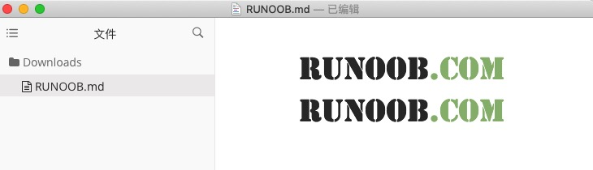

# Markdown学习记录
## 一、段落格式
两个空格加回车是换行。  
空一行是换段。

*斜体* _斜体_   
**粗体** __粗体__ 

注：markdown all in one 快捷键  
* ctrl+I可以倾斜  
- ctrl+B可以加粗
+ ctrl+M切换数学环境

## 二、区块
> 我在第一层
> >我在第二层
> >>我在第三层  

## 三、代码
1. 一行代码：反引号 `print()` 
2. 多行代码：三个反引号  
    python代码:
    ```python
    import numpy as np
    import tensorflow as tf
    ```
    Java代码
    ```java
    public class JavaTest(){
        private number;
        class getnumber();
    }
    ```
3. 多行代码：缩进式（前面必须有空行）
   
        #include  <stdio.h>
        int main(void)
        {
            printf("Hello world\n");
        }

## 四、链接
1. 这是一个链接：[百度](www.baidu.com)  
2. 这是一个链接：<https://www.runoob.com>  
3. 使用变量（必须空行）  
   谷歌的网站为 [Google][1]，我们平时访问[Google][1]，通常用的这个网址

   [1]: http://www.google.com/

## 五、表格
|张三|李四|王五|
|---|---|---|
|98|100|82|
|2|1|3|
|2|1|3|
## 六、图片
1. （all in one）粘贴图片Ctrl+Alt+V  
  
他会自动创建文件，然后放在文件夹里面
2. 正常的格式  
  
图片也可以使用变量
## 七、公式
$$
f(x)=sin^2(x)
$$
$$
\sum_{i=1}^n a_n =0
$$